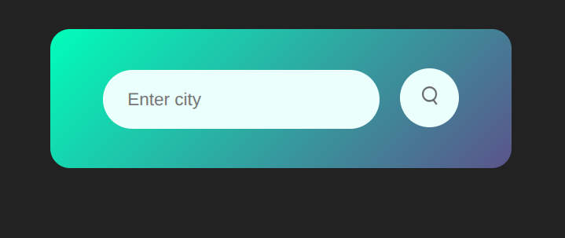
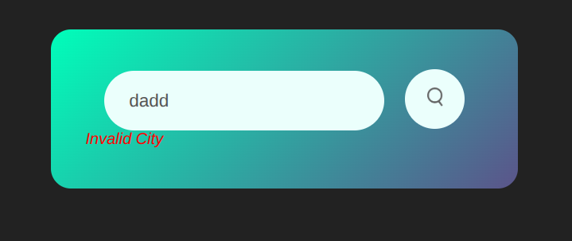
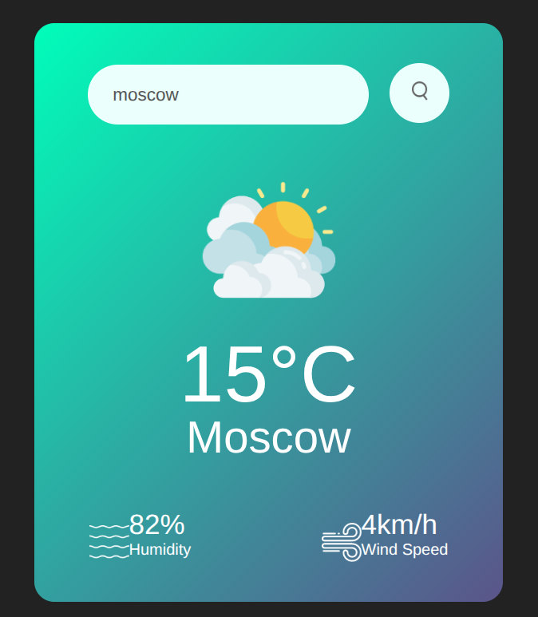

# **🌦️ Weather App — Elegant, Lightning‑Fast City Forecasts**

[](#)
[](#)
[](#)
[](#)

A minimal, gorgeous, and **focus‑first** weather app that turns a city name into a clean, readable forecast—**no clutter, no ads, just answers.**

> **Pitch:** Designed for students and demos, this app showcases pragmatic API integration, elegant UI, and responsible error handling. Perfect for coursework, hackathons, and portfolio showcases.

---

## ✨ **Features**

* 🔍 **City Search:** Type a city, tap search, get instant weather.
* 🌡️ **At‑a‑glance metrics:** Temperature (°C), humidity (%), and wind speed (km/h).
* 🖼️ **Auto‑switch visuals:** Icon updates based on weather conditions (e.g., `Rain`, `Clear`, `Clouds`).
* 🚦 **User feedback:** Graceful **Invalid City** message on bad input or network issues.
* 📱 **Responsive card UI:** Gradient background, accessible fonts, and touch‑friendly controls.

---

## 🗂️ **Project Structure**

```
root/
├─ index.html        # App markup (input, search button, results card)
├─ style.css         # Gradient card UI + responsive layout
├─ script.js         # Fetch weather + DOM updates + error handling
└─ assets/           # Visuals used by the UI
   ├─ search.png
   ├─ humidity.png
   ├─ wind.png
   ├─ Rain.png
   ├─ Clear.png
   └─ Clouds.png     # (Add more as needed: Snow.png, Mist.png, Drizzle.png, etc.)
```

> **Note:** The code expects `assets/<MainWeather>.png`, where `<MainWeather>` is the `main` field from the API (e.g., `data.weather[0].main`).

---

## 🚀 **Quick Start**

1. **Clone or download** this repository.

```
# via git
git clone https://github.com/itxMUmerFarooqBajwa321/weather_app.git
cd weather-app
```

2. **Add your API key** (best practice):

* Create a file named `.env` (if you use a bundler/dev server) or set a variable in `script.js`.
* Replace the inline key in `script.js` with a variable you control, e.g.:

```js
// script.js (recommended pattern)
const OPENWEATHER_API_KEY = "YOUR_API_KEY_HERE"; // <- never commit a real key
```

* Then build your request URL using that variable.

> **Security heads‑up:** Don’t commit real API keys. For public demos, consider a tiny proxy server to keep the key off the client.

3. **Open the app** locally. Since this is plain HTML/JS, you can simply double‑click `index.html` or serve with any static server:

```
# option A: open directly
open index.html  # macOS
start index.html # Windows

# option B: serve (recommended)
python3 -m http.server 5173
# then visit: http://localhost:5173
```

---

## 🔑 **Getting an OpenWeatherMap API Key**

1. Sign up at OpenWeatherMap and create an API key.
2. Wait for activation (usually a few minutes).
3. Place the key in your `script.js` or environment and **do not** commit it.

**Endpoint used:**

```
https://api.openweathermap.org/data/2.5/weather?q=<CITY>&appid=<YOUR_KEY>&units=metric
```

**Response fields consumed:**

* `data.main.temp` → Temperature (rounded)
* `data.main.humidity` → Humidity (%)
* `data.wind.speed` → Wind speed (rounded, km/h)
* `data.name` → City name (normalized by the API)
* `data.weather[0].main` → Primary condition (used to pick icon)

---

## 🧠 **How It Works (in 15 seconds)**

* On click of **Search**, the app fetches the **Current Weather** endpoint.
* It parses JSON, updates the DOM (city, temp, humidity, wind).
* It maps `weather[0].main` to an icon in `/assets`.
* On failure (invalid city, network), it shows the **Invalid City** banner and hides the weather card.

---

## 🎨 **UI & UX Details**

* **Typography:** Poppins, clean and legible.
* **Theme:** 135° gradient (teal → indigo), rounded corners, soft shadows.
* **Scale:** 90% viewport width (max 470px) for a compact, mobile‑first card.
* **Feedback:** Hidden sections only display when data is valid; errors are red and italicized for clarity.

---

## 🛠️ **Customization**

* **Add icons:** Place more images in `/assets` matching possible `main` values: `Snow.png`, `Thunderstorm.png`, `Drizzle.png`, `Haze.png`, `Mist.png`, etc.
* **Units:** Change `units=metric` → `imperial` if needed.
* **Copy:** Edit labels (`Humidity`, `Wind Speed`) inside `index.html`.
* **Styling:** Tweak gradients, spacing, and font sizes in `style.css`.

---

## ✅ **Validation & Error States**

* ✔️ Empty input → No call until the button is clicked.
* ✔️ Bad city/network error → **Invalid City** banner shows; weather card hides.
* ✔️ Logging → Errors print to console for debugging.

> **Pro tip:** You can extend error handling by checking `response.ok` and a `data.cod !== 200` guard before reading fields.

---

## 🧩 **Code Highlights**

```html
<!-- index.html (excerpt) -->
<input id="city-input" type="text" placeholder="Enter city" spellcheck="false">
<button id="search-btn"></button>
<div id="invalid-city">Invalid City</div>
```

```css
/* style.css (excerpt) */
.card{ max-width:470px; background:linear-gradient(135deg,#00feba,#5b548a); color:#fff; border-radius:20px; }
.weather{ display:none; }
#invalid-city{ display:none; color:red; font-style:italic; }
```

```js
// script.js (excerpt)
fetch(`https://api.openweathermap.org/data/2.5/weather?q=${city}&appid=${OPENWEATHER_API_KEY}&units=metric`)
  .then(r => r.json())
  .then(data => { /* update DOM + icon mapping */ })
  .catch(err => { /* show Invalid City, hide weather */ })
```

---

## 🧪 **Ideas for Next Steps**

* Hourly & 7‑day forecasts with charts.
* Geolocation (opt‑in) for “Use my location”.
* Better error copy (e.g., “City not found”, “Check your internet connection”).
* Keyboard UX: press **Enter** to search.
* Loading state skeletons and subtle animations.
* i18n (e.g., English ↔ Urdu labels).

---

## 🐞 **Troubleshooting**

* **I always see “Invalid City”.**

  * Check your API key is active and correct.
  * Inspect the console for `401`/`404`.
  * Confirm the city spelling; try `London`, `New York`, `Lahore`.
* **Icons don’t change.**

  * Ensure `/assets/<Condition>.png` exists for the returned `main` value.
  * Check console logs to see the attempted path.
* **Nothing happens on click.**

  * Make sure `script.js` is loaded **after** the DOM or use `DOMContentLoaded` (already present).

---

## 🤝 **Contributing**

PRs welcome! Add new icons, improve error handling, or extend the UI with forecasts and charts. Please follow conventional commits and open an issue to discuss larger changes.

---

## 📜 **License**

This project is released under the **MIT License**. See `LICENSE` for details.

---

## 🙏 **Credits**

* Weather data provided by **OpenWeatherMap**.
* Icons are local assets in `/assets`.
* Typeface: **Poppins**.

---

## 📸 **Screenshots (Optional)**

> Add screenshots or GIFs here—drop them in a `/screens` folder and reference them below.


Start


Invalid city name


City Name, Humidity, Wind Speed, Weather Situation (clear,rainy etc)

---

## 🧾 **Appendix: Mapping API → UI**

| API Field         | Example    | UI Target          |
| ----------------- | ---------- | ------------------ |
| `main.temp`       | `21.4`     | `21°C` (rounded)   |
| `main.humidity`   | `50`       | `50%`              |
| `wind.speed`      | `4.2`      | `15km/h` (rounded) |
| `name`            | `New York` | City heading       |
| `weather[0].main` | `Rain`     | `assets/Rain.png`  |

> **Reminder:** If you add a condition not in assets, create the matching image first.

---
